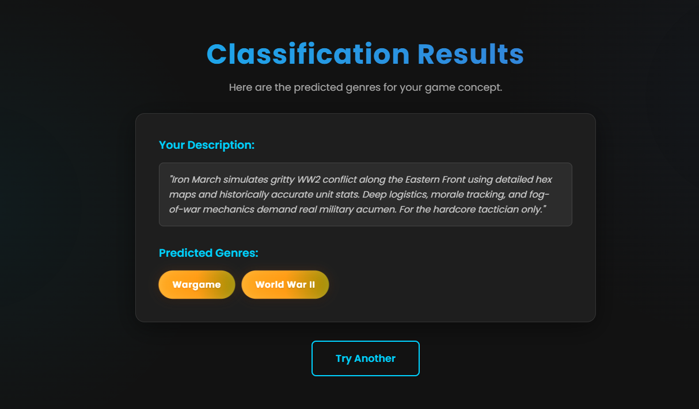

# MultiLabel-BoardGame-Category-Classifier

A text classification model from data collection, model training, and deployment.  
The model can classify board games into categories.  

 ## Data Collection

Data was collected from BoardGameGeek.  The data collection process is divided into 2 steps:

1. **Board Game URL Scraping:** The board game urls were scraped with `scraper\boardgame_url_scraper.py` and the urls are stored along with board game title in `scraper\boardgame_urls.csv`
2. **Board Game Details Scraping:** Using the urls, board game description and categories are scraped with `scraper\boardgame_details_scraper.py` and they are stored in `data\boardgame_details.csv`

In total, I scraped 29,565 board game details.

## Data Preprocessing

Initially there were *93* different categories in the dataset. After some analysis, I found out *3* of them are rare. So, I removed those categories and then I have *90* categories. After that, I removed the description without any categories resulting in *28,827* samples.

## Model Training

Finetuned a `distilrobera-base` model from HuggingFace Transformers using Fastai and Blurr. The model training notebook can be viewed [here](https://colab.research.google.com/drive/1TZ8u98hLOPXXFPtGR-VTphth8zCa0F-E?usp=sharing)

## Model Compression and ONNX Inference

The trained model has a memory of 316+MB. I compressed this model using ONNX quantization and brought it under 81MB. 
 
## Model Deployment
The compressed model is deployed to HuggingFace Spaces Gradio App. The implementation can be found in `deployment` folder or [here](https://huggingface.co/spaces/nosttradamus/multilabel-boardgame-genre-classifier) 
The keys of `deployment\category_types_encoded.json` shows the board game categories.

## Web Deployment
Deployed a Flask App built to take descprition and show the categories as output. Check `flask ` branch. The website is live [here](https://multilabel-boardgame-genre-classifier.onrender.com) 

